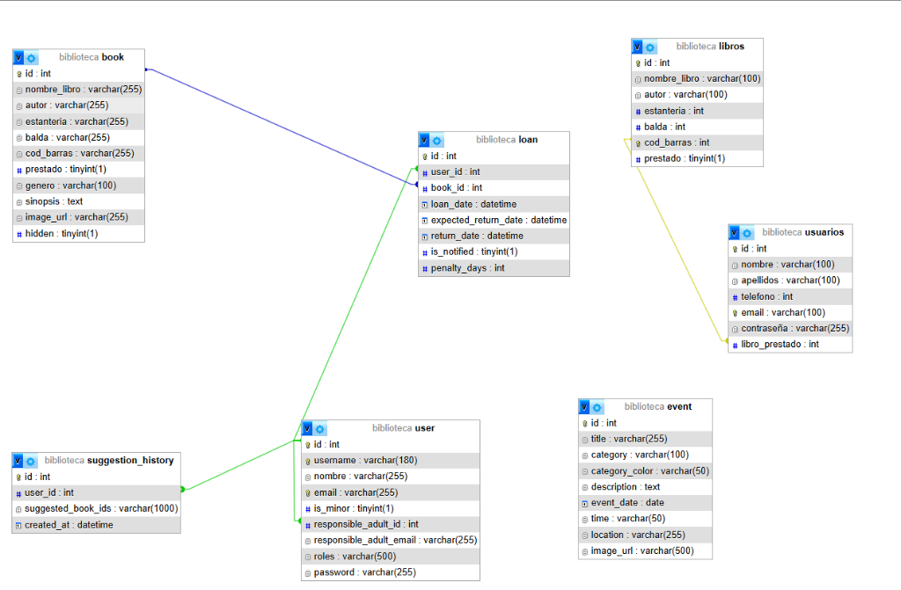

# Alauxa - Sistema de Gestión de Biblioteca

## 1. ¿Qué es el proyecto?
**Alauxa** es un ecosistema digital diseñado para la modernización de bibliotecas. No es solo un catálogo, sino una plataforma integral que une la gestión tradicional con tecnologías de vanguardia como la Inteligencia Artificial local y la orquestación mediante microservicios. 

El objetivo principal es eliminar la carga administrativa mediante la automatización de procesos (importaciones masivas, cálculo de sanciones) y mejorar la experiencia del lector a través de recomendaciones personalizadas y una interfaz intuitiva.

---

## 2. Modelo de Datos (Arquitectura de Información)

La base de datos relacional (MySQL) es el corazón del sistema. Como se observa en el diagrama superior, el esquema ha evolucionado hacia una estructura normalizada en inglés, manteniendo compatibilidad con tablas legadas durante la transición.

### Tablas Principales:
*   **`book` (Libros):** Almacena la información bibliográfica. Incluye metadatos enriquecidos como `genero`, `sinopsis` e `image_url`. El campo `hidden` permite una gestión lógica de la visibilidad sin borrar registros físicos.
*   **`user` (Usuarios):** Gestiona la identidad de los lectores. Incluye flags como `is_minor` para cumplir con normativas de protección y campos de contacto para tutores legales (`responsible_adult_email`).
*   **`loan` (Préstamos):** Es la tabla transaccional que une libros y usuarios. Controla el ciclo de vida del préstamo: `loan_date` (inicio), `expected_return_date` (límite) y `return_date` (devolución real).
*   **`suggestion_history`:** Almacena el rastro de las recomendaciones generadas por la IA para cada usuario, permitiendo un aprendizaje continuo del sistema sobre los gustos del lector.
*   **`event`:** Permite la gestión de un calendario cultural vinculado a la biblioteca (eventos, charlas, presentaciones).
*   **`libros` / `usuarios`:** Tablas originales en español utilizadas durante la fase inicial y que sirven de puente para la migración de datos antiguos.

---

## 3. Tecnologías y Arquitectura

El sistema utiliza una arquitectura de **Microservicios Dockerizados**, lo que garantiza que cada componente pueda escalar o actualizarse de forma independiente.

### Frontend: La Experiencia de Usuario
*   **React 19 + TypeScript:** Proporciona una interfaz reactiva y segura ante errores de tipado.
*   **Vite:** Optimiza el tiempo de compilación y recarga en caliente, permitiendo un desarrollo ágil.
*   **TailwindCSS v4:** Implementa un sistema de diseño basado en utilidades, permitiendo una personalización total de la UI (temas, animaciones, responsividad).
*   **Nginx:** Actúa como un servidor de alto rendimiento para los archivos estáticos, gestionando las rutas del lado del cliente de forma eficiente.

### Backend: El Motor Lógico
*   **Python + Flask:** Una API RESTful rápida y modular.
*   **JWT (JSON Web Tokens):** Asegura que cada petición sea auténtica y pertenezca al usuario correcto sin necesidad de sesiones en el servidor.
*   **SQLAlchemy ORM:** Permite interactuar con la base de datos usando objetos Python, lo que previene ataques de Inyección SQL y facilita el mantenimiento del código.
*   **APScheduler (Cron Jobs):** Un motor de tareas que se ejecuta cada noche para revisar los préstamos vencidos y aplicar sanciones automáticamente.
*   **Flask-Mail:** Automatiza el envío de recordatorios de devolución y alertas de nuevas adquisiciones.

### Inteligencia Artificial: Ollama
*   **Modelo Mistral:** Alauxa integra un modelo de lenguaje de 7 billones de parámetros que corre **localmente** en el servidor. Esto significa que los datos de los usuarios y libros nunca salen de la infraestructura propia, garantizando privacidad absoluta y eliminando costes por uso de APIs externas (como OpenAI).

---

## 4. Conceptos Clave y Flujos de Trabajo

### El Sistema de "Huella" (Ingesta de Datos)
La importación de datos masivos suele ser un problema en sistemas antiguos. Alauxa soluciona esto con su motor de **Normalización de Huella**:
1.  **Carga:** El administrador sube un CSV (ej. el inventario histórico).
2.  **Detección:** El sistema identifica automáticamente el formato de fecha y los encabezados.
3.  **Etiquetado:** Cada registro se marca con una "huella" (metadato de origen) que permite saber exactamente cuándo y de qué archivo provino un libro, facilitando limpiezas posteriores si el archivo original tenía errores.

### Gestión Dinámica de Penalizaciones
El sistema de sanciones es **progresivo y automático**:
*   Si un libro no se devuelve en la `expected_return_date`, el sistema activa el campo `penalty_days`.
*   Mientras el usuario tenga días de penalización activos, la lógica de negocio del backend bloqueará cualquier intento de realizar un nuevo préstamo.
*   La interfaz (UI) reflejará este estado con colores de alerta (rojo/naranja) para informar al usuario de su situación.

### Asistente IA y Recomendaciones
A diferencia de los filtros tradicionales, el asistente entiende el contexto:
*   El backend recupera el historial de `suggestion_history` y los gustos del usuario.
*   Se genera un *prompt* enriquecido para Ollama con los títulos disponibles en la tabla `book`.
*   La IA devuelve una recomendación narrada: *"Basándome en que te gustó La Regenta, te sugiero Paula de Isabel Allende por su profundidad narrativa..."*.

---

## 5. Diseño y Accesibilidad (UI/UX)
La interfaz de Alauxa ha sido diseñada siguiendo estándares de **W3C/WCAG**:
*   **Legibilidad:** Fuentes modernas (Inter/Outfit) y contrastes de color optimizados.
*   **Interactividad:** Uso de micro-animaciones para feedback inmediato (hover en botones, loaders en transiciones).
*   **Consistencia:** Los iconos y placeholders están perfectamente alineados para evitar confusiones visuales, especialmente en pantallas móviles donde el espacio es reducido.
